# hi
hello there.

## what
badges powered through [shields.io](https://shields.io)

  

## what
i mainly use the following for personal projects (open/semi-open/closed):

- **gdscript** in **godot engine**
- **c#** with **.net 7** in visual studio community 2022 and jetbrains rider
  - have worked with c# since .net framework 4.x, more comfortable with .net core and beyond
- **go** in jetbrains goland and vscode

for education reasons (college) i have worked with:

- **java** for a few trimesters
  - working in **intellij**
- **python 3** for one trimester
  - working in **visual studio**
- **c** for a few trimesters
  - linux-based oses only, using `gcc` and `gdb`
  - not fully certain about standard, but most likely `c99`
  - both in `vim` and vscode using remote-ssh
    - *i can close vim but it's a secret shhhhhh*

i have used these in the past:

- **gamemaker language** ranging from **gm:s 1.4.x** to **gms2.3+**
  - most comfortable with later versions with structs and memory management

## what

here's metrics provided by lowlighter/metrics that's collapsed for space atm

## what

  
here's some badges?

  
  a more... comphrensive list of tools i use creatively overall is available [on my website](https://xubiod.net/tools)
  
  these came from https://badges.pages.dev/
  
  ### hardware/oses
  
  
  
  
  
  
  
  
  
  ### langs
  
  
  
  
  
  
  
  
  
  
  
  ### regularly used softwares
  
  
  
  
  
  
  
  
  
  
  
  
  
  
  
  
  
  
  
  
  
  ### services
  
  
  
  
  
  
  
  
  
  
  
  
  
  
  
  
  
  
  
  
  
  
  
  
  ### scp foundation on its own because it doesn't fit but i like it
  
  

## what
you can throw some money at my [donate page](https://xubiod.net/donate/) on my site but please don't

## what
can you stop asking what

<!--
**xubiod/xubiod** is a ✨ _special_ ✨ repository because its `README.md` (this file) appears on your GitHub profile.

Here are some ideas to get you started:

- 🔭 I’m currently working on ...
- 🌱 I’m currently learning ...
- 👯 I’m looking to collaborate on ...
- 🤔 I’m looking for help with ...
- 💬 Ask me about ...
- 📫 How to reach me: ...
- 😄 Pronouns: ...
- ⚡ Fun fact: ...
-->
